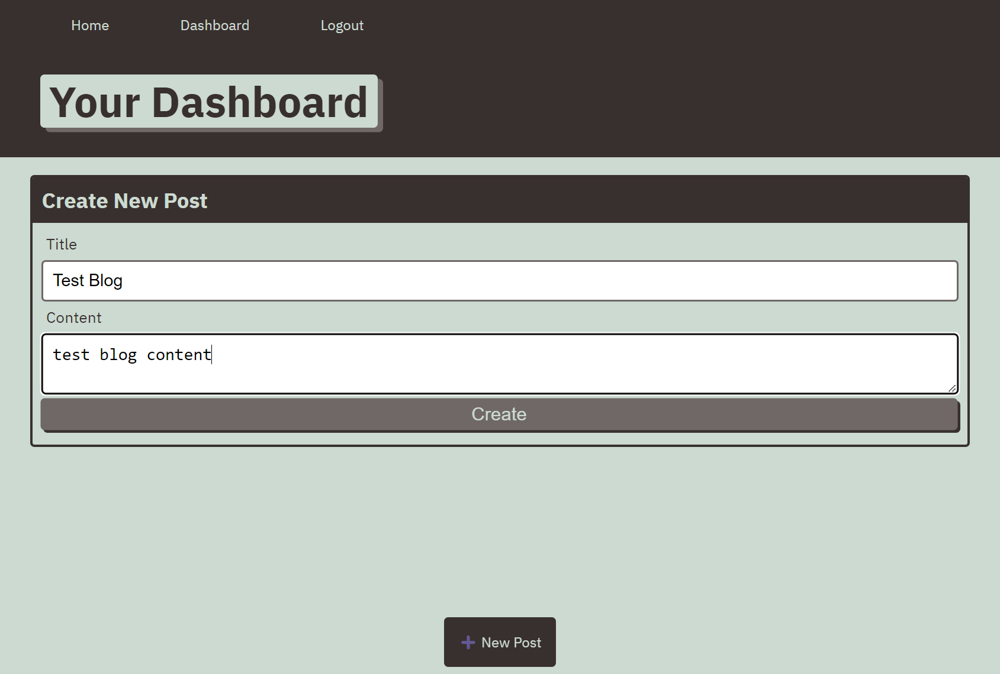

# Tech Blog Website

Tech Blog Website is a web based website that allow their website users to create and comment on any blog that is created by the website users.
The user is required to sign up to the website to be able to create or comment on any blog that is created by other website users.
The user accounts are free to create and doesn't require any payments.
The user would have access to the following pages once logged in:
* Home where they will be able to comment on any available blogs.
* Dashboard where they are able to create or manage existing blog created by the user.
* Log in.
* Log out.
Also they are able to sign out from the website by clicking on Sign in button that is available on the website navigation bar then on "Sign up instead" link.

## GitHub Repo URL
https://github.com/AllenHirmiz/Tech-Blog-Website

## Website URL (Heroku)
https://pure-falls-49224-f0bbbc18d6b4.herokuapp.com/login

## Table of Contents
Navigation menu
Home page
Dashboard
Login
Logout

## Installation
Web Based
## Technologies Used
Tech Blog Website website is built using the following technologies:

1. [MySQL][def1] Documentation
2. [mysql2][def2] Documentation
3. [Sequelize v6][def3] Documentation
4. [Express HandleBars][def4] Documentation

    
[def1]: https://dev.mysql.com/doc/
[def2]: https://www.npmjs.com/package/mysql2
[def3]: https://www.npmjs.com/package/sequelize
[def4]: https://www.npmjs.com/package/express-handlebars

## Mock-Up

The following image shows the web application's appearance and functionality:

## Main Page

## Blog Page

## Sign Up Page

## Mobile Page

